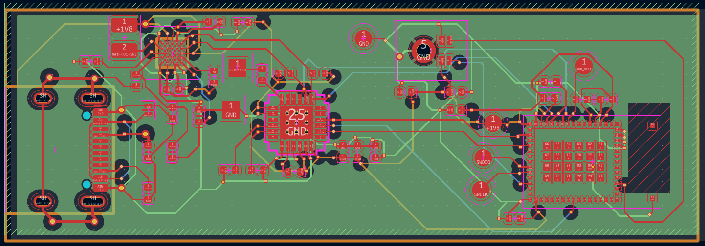
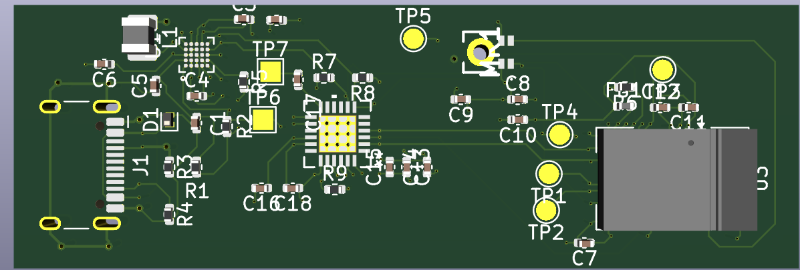
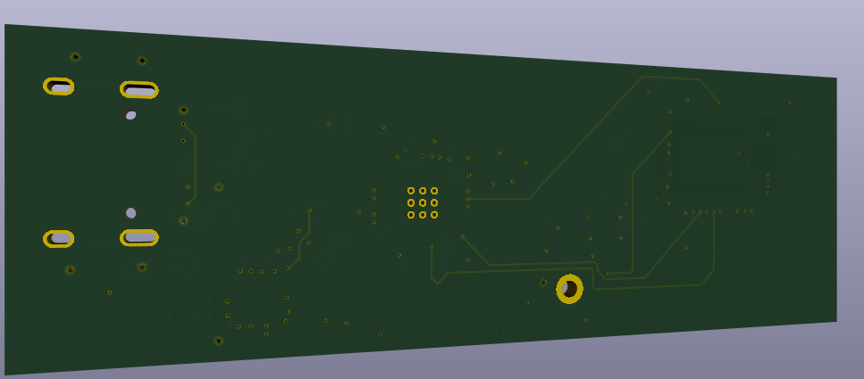

# 🚀 Sistema Embebido STM32 & PMIC - Diseño PCB de 4 Capas (HDI)

Este repositorio contiene el diseño de hardware y los archivos de manufactura industrial para una tarjeta de circuito impreso de 4 capas. El proyecto se centra en la integración de un microcontrolador de alto rendimiento y gestión de energía, aplicando técnicas de interconexión de alta densidad.

## 📸 Vistas del Proyecto

### Ruteo de Alta Densidad (Layout 2D)

*Detalle del ruteo multicapa mostrando el abanico de salida del BGA, conexiones del PMIC y gestión de tolerancias DRC.*

### Renderizado 3D (Ensamblaje)
**Capa Superior (Top):**

**Capa Inferior (Bottom):**

## ⚙️ Especificaciones Técnicas

*   **Stackup:** 4 Capas (Capa Superior, Plano GND, Plano VCC, Capa Inferior).
*   **Tecnología HDI:** Implementación de reglas de interconexión de alta densidad para encapsulados complejos.
*   **Procesamiento:** Microcontrolador STM32 en encapsulado BGA.
*   **Gestión de Energía:** PMIC integrado para la regulación eficiente de voltajes.
*   **Reglas de Manufactura (DRC):**
    *   Aplicación estricta de *Via-in-Pad* (0.15mm) para maximizar el espacio y garantizar la integridad de las señales.
    *   Ajuste de impedancias, anchos de pista y aislamientos para asegurar la viabilidad de manufactura sin cortocircuitos.

## 🛠️ Herramientas Utilizadas

*   **KiCad:** Layout de PCB, validación de reglas de diseño (DRC) y generación de visualizaciones 3D.
*   **Git / GitHub:** Control de versiones del hardware y respaldo en la nube del paquete de manufactura.

## 📁 Estructura del Repositorio

*   `/aam_bom_pcb/`: Archivos fuente del proyecto de KiCad (esquemático, PCB, archivos de reglas de diseño).
*   `/gerbers/`: Paquete de manufactura industrial empaquetado (Archivos Gerber X2 y taladros Excellon Drill), validado y listo para fabricación y ensamble (PCBA).

---
## 👥 Créditos y Equipo de Trabajo

Este proyecto de hardware fue desarrollado de manera colaborativa, dividiendo el diseño lógico de la implementación física:

*   **Nava Hernández José Antonio**: Autoría intelectual del proyecto, diseño de la lógica del sistema y captura del esquemático original.
*Layout de PCB, ruteo de alta densidad y preparación para manufactura a cargo de Emilio Severo Bernal López, Ingeniero en Comunicaciones y Electrónica.*
